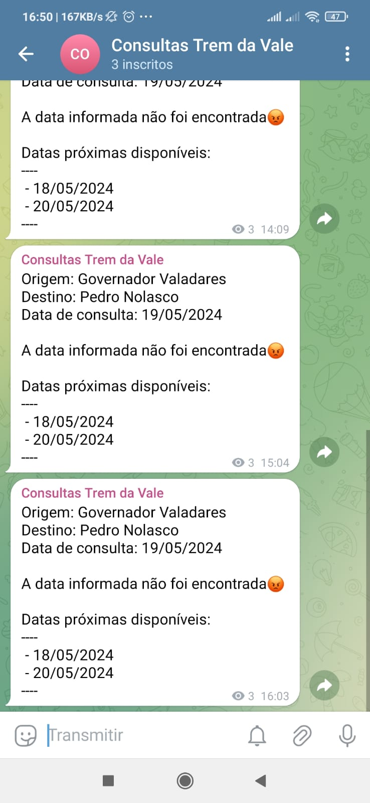

# Consulta Trem da Vale



## Como usar

crie um arquivo .env na pasta `src` com as seguintes variáveis:

```env
TELEGRAM_BOT_TOKEN=<token do bot>
TELEGRAM_CHAT_ID=<id do chat>
```

e execute o comando:

```bash
python src/main.py --data_ida "01/06/2024"
```

## Requisitos

- python=3.10

### Instalação

```bash
pip install -r requirements.txt
```